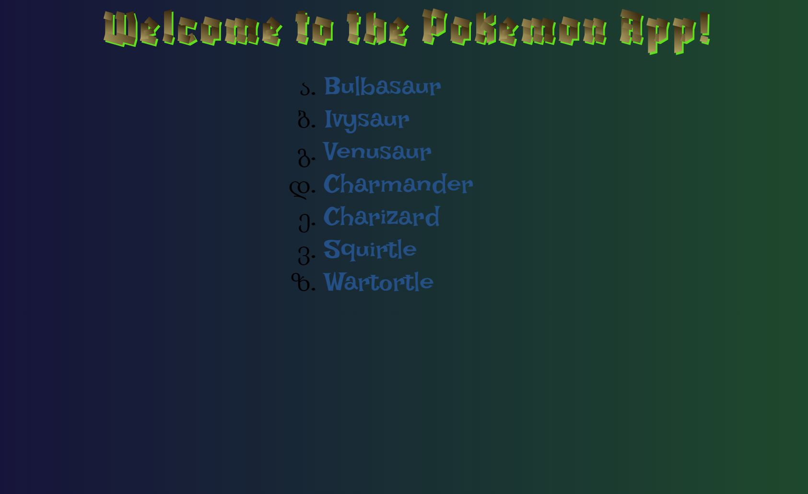
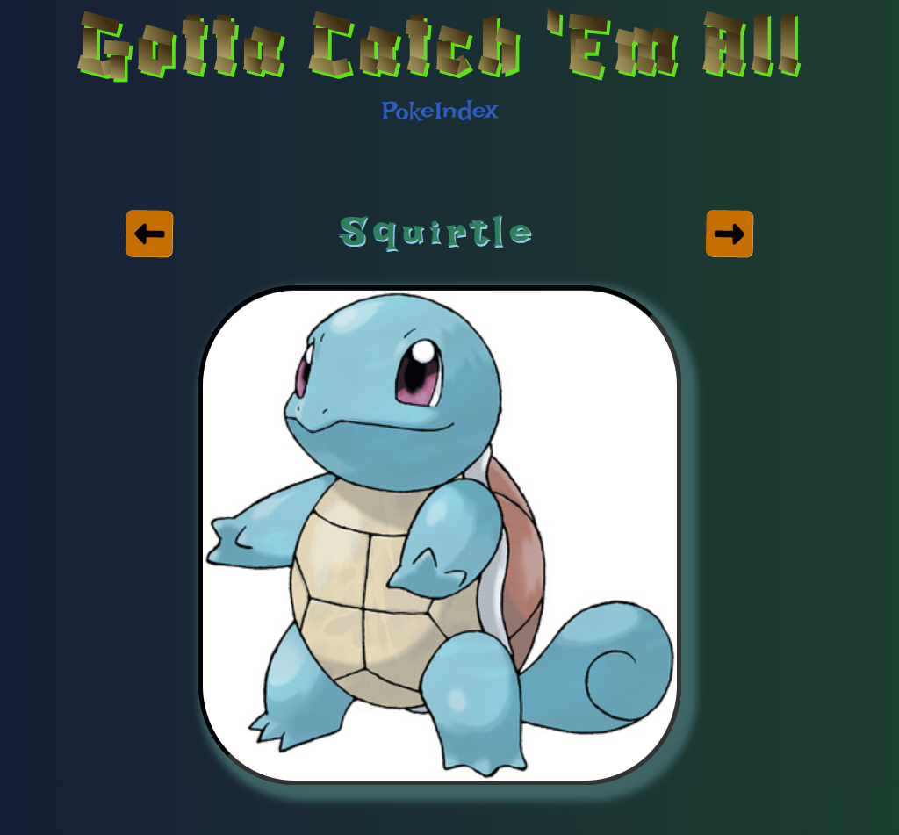
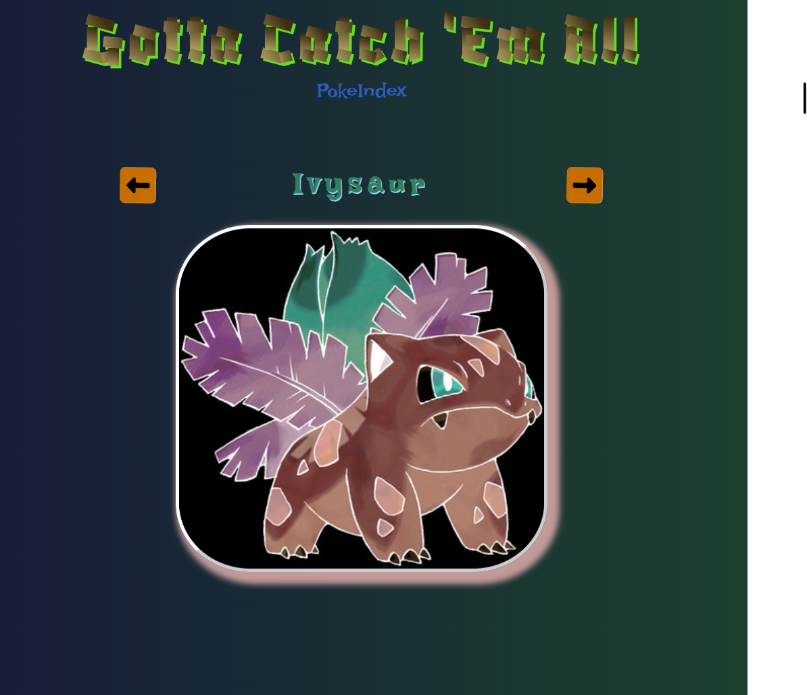

#Pokemon Express
### PerScholas assignment

_9/19/2022_  

> Update and Create routes are working.  
> Update route is using a POST because everything I have found on the subject says that to do a PUT from an HTML form requires express middleware.  
> So the POST route on edit just splices the edited record at the index.

These screenshots were from the pre-update and create commits.

